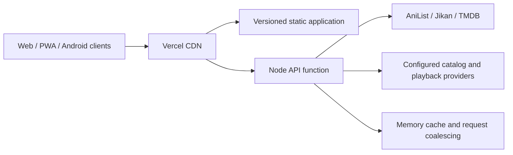

# zxkai


<p align="center">
  <strong>A responsive anime catalog and player for the web, phones, tablets, Android, and Android TV.</strong>
</p>

<p align="center">
  <a href="https://zenkaitv.com"><strong>Open zxkai</strong></a>
  &nbsp;|&nbsp;
  <a href="docs/INSTALLATION.md">Install</a>
  &nbsp;|&nbsp;
  <a href="docs/DEPLOY.md">Deploy</a>
  &nbsp;|&nbsp;
  <a href="docs/API.md">API</a>
  &nbsp;|&nbsp;
  <a href="docs/TROUBLESHOOTING.md">Troubleshooting</a>
</p>

<p align="center">
  <a href="https://github.com/JSolanoDev/AnimeTV/actions/workflows/ci.yml"></a>
  <a href="https://zenkaitv.com"></a>
  
  
  <a href="LICENSE"></a>
</p>

## Preview

<p align="center">
  <a href="docs/screenshots/home-desktop.webp"></a>
</p>

<table>
  <tr>
    <td width="70%"><a href="docs/screenshots/anime-details.webp"></a></td>
    <td width="30%"><a href="docs/screenshots/home-mobile.webp"></a></td>
  </tr>
  <tr>
    <td align="center"><sub>Full metadata, artwork, seasons, and episodes</sub></td>
    <td align="center"><sub>Responsive phone and tablet layout</sub></td>
  </tr>
</table>

## What zxkai includes

- **Recent-release home screen** with a daily carousel, high-resolution artwork, blur-until-ready loading, and fast manual navigation.
- **Smart anime search** with typo tolerance, alternate-title matching, franchise grouping, and natural ordering so original seasons appear before sequels.
- **Rich title pages** with stable posters and backdrops, complete descriptions, English and Spanish text, expandable summaries, seasons, episode names, dates, and thumbnails.
- **Long-series support** with predictable episode filtering and navigation for catalogs such as Naruto, One Piece, and Bleach.
- **Latest episode routing** that opens the newest available episode in context without autoplaying it.
- **Multi-source playback** with HLS, direct video, and embed support. AnimeAV1 is preferred when available, with provider fallbacks preserved when it is not.
- **Google Cast controls** with receiver-compatible source selection, duplicate-device protection, and an explicit stop-casting action.
- **Responsive playback** for desktop, portrait phones, tablets, and TV, including compact episode titles and fullscreen behavior.
- **Personal library** with animated favorite feedback, resilient favorite storage, continue watching, history, and resume positions.
- **Weekly schedule** with stable Monday-to-Sunday sections, local-time airings, and 12-hour clock formatting.
- **Isolated adult mode** with its own catalog, releases, artwork pipeline, favorites, and a persistent random-title control.
- **Installable clients** as a PWA, Android mobile/tablet APK, and Android TV APK from the same codebase.

## Performance and reliability

ZenkaiTV is designed to avoid scaling upstream traffic one-to-one with visitors:

- Vercel CDN caching and stale-while-revalidate for shared catalog and metadata routes.
- In-flight request coalescing for identical upstream work.
- Bounded timeouts, rate-limit handling, and stale fallbacks instead of aggressive retries.
- A compact homepage bootstrap followed by deferred catalog enrichment.
- Lazy metadata and artwork hydration so navigation stays responsive.
- Versioned static assets and a service worker for reliable updates.
- Stable image selection so cards and carousel slides do not swap artwork after rendering.

The implementation and route-by-route decisions are documented in the [Vercel Function audit](docs/vercel-function-audit.md).

## Architecture



The frontend is framework-free JavaScript and CSS. The same Node handler runs locally and through the Vercel catch-all adapter. Shared metadata is cacheable at the edge, while short-lived media URLs remain narrowly cached so playback and Cast behavior stay correct.

## Quick start

Requirements: Node.js 20.9 or newer and npm.

```bash
git clone https://github.com/JSolanoDev/AnimeTV.git
cd AnimeTV
npm install
cp .env.example .env.local
npm run dev
```

Open [http://localhost:4173](http://localhost:4173). Optional API keys and provider bridges are documented in [.env.example](.env.example); the catalog UI can still start when optional providers are unavailable.

On Windows, use `Copy-Item .env.example .env.local` in place of `cp`.

## Validation

```bash
npm run check
npm test
npm run vercel-build
```

GitHub Actions runs the static checks, regression suite, lint rules, adult release checks, and production build for every pull request and push to `main`.

## Android builds

With the Android SDK and a compatible JDK installed:

```powershell
npm run android:build
```

| Target | APK |
| --- | --- |
| Phone and tablet | `android/app/build/outputs/apk/mobile/debug/app-mobile-debug.apk` |
| Android TV | `android/app/build/outputs/apk/tv/debug/app-tv-debug.apk` |

See [Android mobile and TV setup](docs/ANDROID_TV.md) for ADB installation and device notes.

## Deployment

The production site is deployed on Vercel. The repository already includes the static build, catch-all API adapter, CDN headers, security headers, and SPA rewrites required by the app.

```bash
npm run vercel-build
```

See the [deployment guide](docs/DEPLOY.md) for Vercel configuration, optional environment variables, cache verification, and self-hosting.

## Project layout

| Path | Purpose |
| --- | --- |
| `index.html`, `styles.css`, `client.js` | Main application shell and UI |
| `js/` | Shared routing, normalization, metadata, image, and source logic |
| `player/` | Video player and playback integrations |
| `animetv-server.js` | Local and serverless API implementation |
| `api/[...path].js` | Vercel Function adapter |
| `scripts/` | Catalog, verification, build, audit, and regression tooling |
| `android/` | Mobile/tablet and Android TV wrappers |
| `docs/` | Setup, API, deployment, and troubleshooting guides |

## Documentation

- [Installation](docs/INSTALLATION.md)
- [Deployment](docs/DEPLOY.md)
- [Android mobile and TV](docs/ANDROID_TV.md)
- [API reference](docs/API.md)
- [Source configuration](docs/SOURCES.md)
- [Troubleshooting](docs/TROUBLESHOOTING.md)
- [Contributing](.github/CONTRIBUTING.md)
- [Security policy](.github/SECURITY.md)

## Privacy and legal

zxkai is a catalog browser and media player. It does not host or store copyrighted video. Playback is supplied by third-party sources configured by the operator, who is responsible for using those sources lawfully. Favorites, history, and resume state are stored on the user's device.

## License

[MIT](LICENSE) Copyright ZenkaiTV contributors.

<p align="center"><sub>Metadata is enriched with AniList, Jikan, and TMDB.</sub></p>
